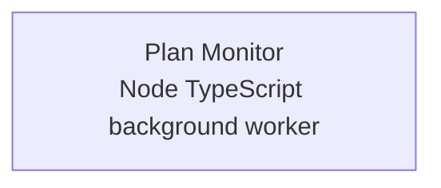

# Azure Debug Plan

> This plan is the source of truth for generating the
> VS Code debug setup in this workspace.
>
> **Status:** Implemented
> **Execution Mode:** auto
> **Created:** 2026-09-21T11:37:43.8702509+08:00
> **Last Updated:** 2026-09-21T11:45:00.0000000+08:00

## Prerequisites

The workspace contains one local Windows background worker and no Azure service dependencies. The repository has `package-lock.json`; npm is the package manager used by the existing scripts. The project plan also records pnpm, which is available locally and is retained here for compatibility.

| Tool / Extension | Category | Service(s) | Installed | Version |
|------------------|----------|------------|-----------|---------|
| Node.js | Runtime | `plan-monitor` | ✅ | 24.19.0 |
| npm | Package manager | `plan-monitor` | ✅ | 11.17.0 |
| pnpm | Package manager | `plan-monitor` | ✅ | 10.30.3 |
| Git | Development tool | `*` | ✅ | 2.55.0.windows.3 |
| Windows Developer Mode / tray permissions | OS configuration | `plan-monitor` | ❓ | — |
| VS Code | Editor | `*` | ❓ | — |
| TypeScript extension | VS Code extension | `plan-monitor` | ❓ | — |
| Vitest extension | VS Code extension | `plan-monitor` | ❓ | — |
| PowerShell 7+ | Shell | `plan-monitor` | ❓ | — |

> ⚠️ **Action required:** Confirm items marked ❓ before using the tray app. Docker and Docker Compose were detected but are not required because no Azure-backed dependency or emulator was found.

## Debug Configurations

| Generate | Debug Config Name | Service Label | Service Root | Project Type | Runtime | Version | Azure Dependencies |
|----------|--------------------|---------------|--------------|--------------|---------|---------|---------------------|
| [x] | Plan Monitor (debug) | Plan Monitor | `.` | background-worker | node-ts | 24.x | — |

ℹ️ Project Type Descriptions

| Project Type | Description |
|-------------|-------------|
| background-worker | A local Node process that polls provider adapters and updates the Windows tray without an HTTP server. |

## Orchestrator

No container orchestrator is required for this service because it has no Azure dependencies or local emulator containers.

| Orchestrator | Container Runtime | Compose Command | Description |
|-------------|-------------------|-----------------|-------------|
| None | — | — | No emulator containers are needed for local debugging. |

## Emulators

| Dependent Service | Emulator | Purpose |
|-------------------|----------|---------|
| None | — | No Azure service dependency was detected. |

## Architecture Diagram

The Node worker loads local settings, polls the configured coding-plan provider adapters, and updates the Windows tray entirely in-process.

## API Test Collections

No HTTP endpoints or event triggers are implemented. The route definitions in `.azure/project-plan.md` are advisory and are not present in the current source tree, so no API test collection will be generated.

## Convenience Scripts

The existing scripts are sufficient for local development and should be preserved rather than re-registered.

| Generate | Script | Registered In | Description |
|----------|--------|---------------|-------------|
| [ ] | `dev` | `./package.json` | Start the tray worker with `tsx src/index.ts`. |
| [ ] | `test` | `./package.json` | Run the Vitest suite. |
| [ ] | `build` | `./package.json` | Compile TypeScript to `dist/`. |

## Debug Configuration Checklist

Debug Configuration Checklist:
✅ Plan Monitor (debug) — ready signal observed (`plan-monitor started`) after a successful `npm run build`, and the Node worker launched from the generated VS Code task chain without errors.